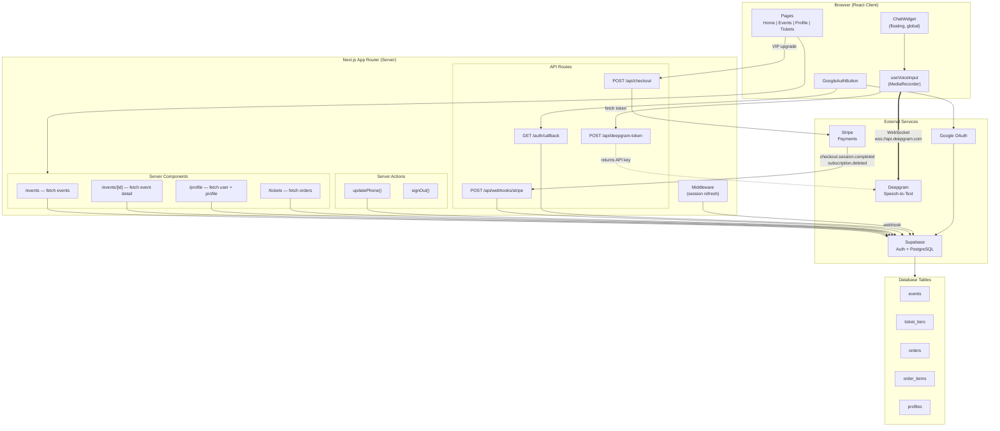
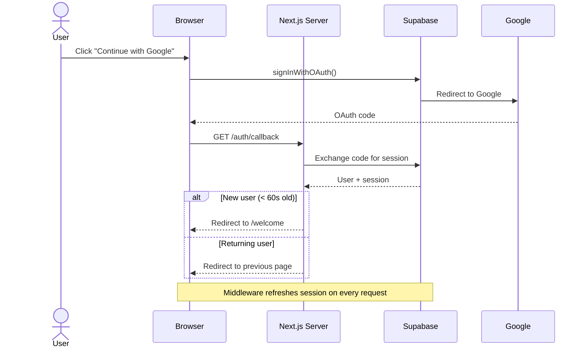
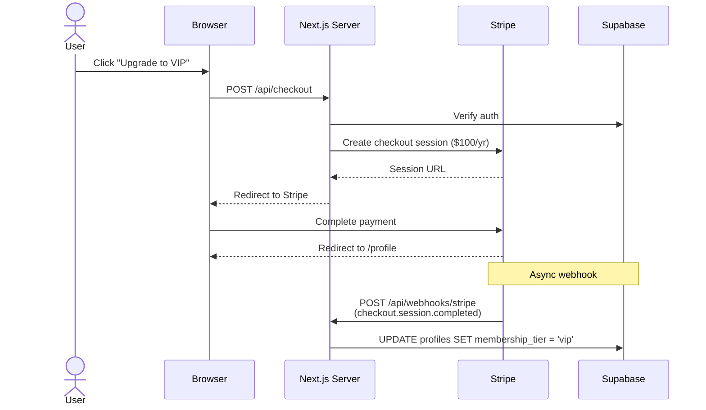
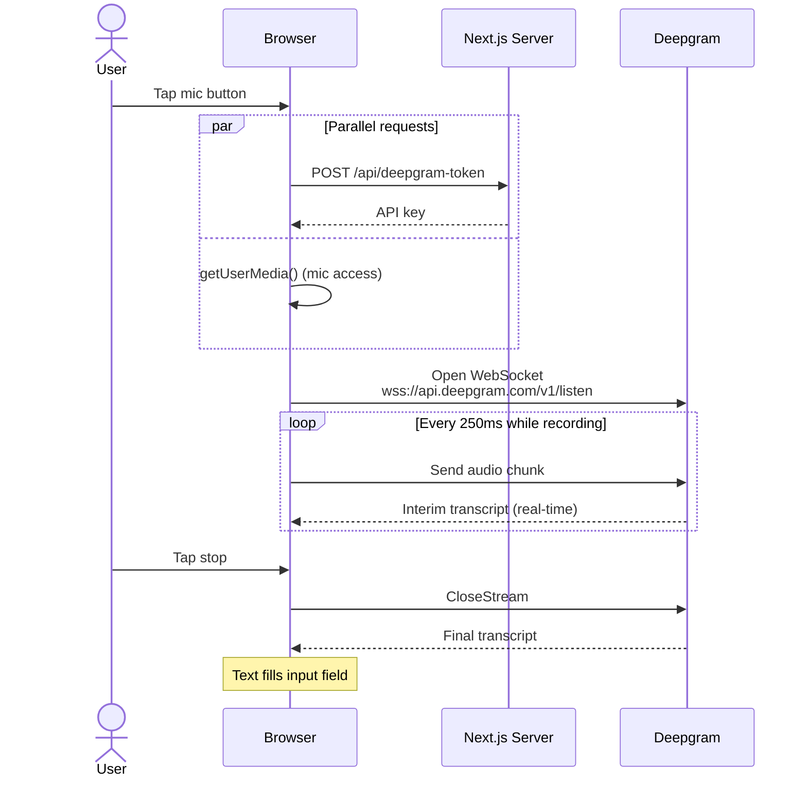
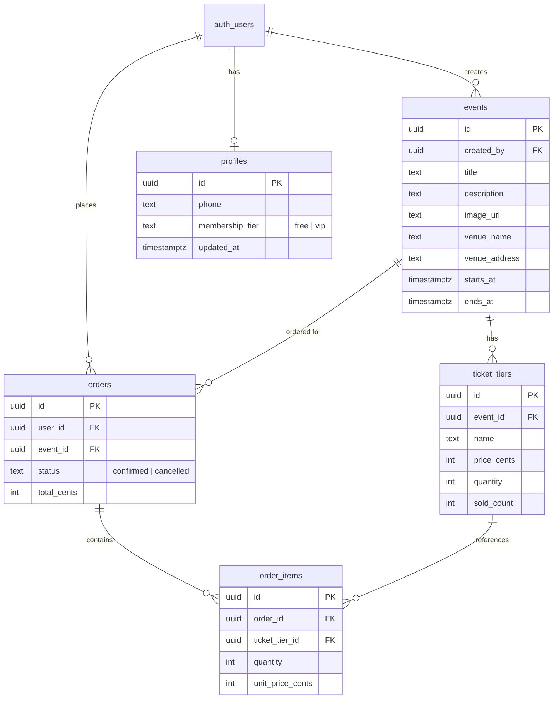

# 4AM.WAV — System Architecture

## High-Level Overview



## Data Flow Diagrams

### Authentication Flow



### VIP Membership Purchase



### Real-Time Voice Transcription



## Database Schema



## Project Structure

```
src/
├── app/                              # Routing & API only
│   ├── api/
│   │   ├── checkout/route.ts         # Stripe checkout session
│   │   ├── deepgram-token/route.ts   # Voice auth token
│   │   └── webhooks/stripe/route.ts  # Subscription lifecycle
│   ├── auth/callback/route.ts        # OAuth callback
│   ├── events/[id]/page.tsx          # Event detail (SSR)
│   ├── events/page.tsx               # Event listing (SSR)
│   ├── profile/page.tsx              # User profile (SSR)
│   ├── tickets/page.tsx              # User orders (SSR)
│   └── layout.tsx                    # Root layout + ChatWidget
│
├── features/                         # Feature-first organization
│   ├── auth/                         # Google OAuth
│   ├── chat/                         # Chat widget + voice input
│   ├── events/                       # Event cards, detail, ticket modal
│   ├── profile/                      # Profile editing + membership
│   ├── tickets/                      # Order display
│   └── welcome/                      # New user onboarding
│
├── components/layout/Navbar.tsx      # Shared navigation
│
├── lib/
│   ├── env.ts                        # Client env validation (Zod)
│   ├── env.server.ts                 # Server env validation (Zod)
│   └── integrations/
│       ├── supabase/                 # client.ts, server.ts, middleware.ts
│       ├── stripe/server.ts          # Stripe SDK init
│       └── deepgram/server.ts        # Deepgram SDK init
│
└── middleware.ts                      # Auth session refresh
```
